# Drosobot

Robô controlado por circuitos **reais** extraídos do conectoma completo do sistema
nervoso da mosca-das-frutas (*Drosophila melanogaster*, dataset **Male CNS**, Janelia).

Nada de rede neural genérica treinada do zero — os pesos sinápticos vêm direto do
mapeamento real do cérebro+cordão nervoso da mosca (microscopia eletrônica + reconstrução
automatizada). A ideia: será que dá pra pegar a fiação de verdade de um circuito de reflexo
da mosca e usar ela pra controlar um robô?

**Fase atual: tudo validado em software, zero hardware físico comprado ainda.**
Circuito só vira compra de peça depois de provar que funciona na simulação.

## O modelo: conectividade real, sinal real, biofisica publicada

Cada neuronio e um leaky integrate-and-fire; cada conexao vem do conectoma. Os
parametros nao sao chutados nem ajustados ate o grafico ficar bonito — sao os de
**Shiu et al. 2024** (*A Drosophila computational brain model reveals sensorimotor
processing*, Nature 634:210), que modelaram o cerebro inteiro da mosca no mesmo
simulador (Brian2) a partir do FlyWire:

```
dv/dt = (-(v - V_repouso) + g) / tau_membrana
dg/dt = -g / tau_sinapse
ao spike de j:  g_i += w_ji

V_repouso = V_reset = -52 mV      tau_membrana = 20 ms
V_limiar          = -45 mV        tau_sinapse  = 5 ms
refratario        = 2.2 ms        atraso       = 1.8 ms
W_sinapse         = 0.275 mV      <- unico parametro livre do modelo
```

`w_ji` = numero de sinapses de j para i (contagem de microscopia eletronica)
× sinal de j × `W_sinapse`. Com limiar 7 mV acima do repouso, uma conexao precisa
de ~25 sinapses pra fazer o alvo disparar sozinha.

Isso substituiu um LIF sem unidade (v de 0 a 1) com um ganho ajustado a mao por
camada. Trocar varios numeros arbitrarios por um parametro livre publicado e a
diferenca entre "ajustei ate funcionar" e "usei o modelo da literatura".

### O sinal da sinapse: onde os papers discordam

Um neuronio e inteiramente excitatorio ou inteiramente inibitorio (lei de Dale), e
o neuroreceptor decide qual. Os dois papers que usamos como referencia classificam
diferente, e **a escolha muda o resultado**:

| | Shiu et al. 2024 (Nature) | Jin et al., FlyGM (arXiv) |
|---|---|---|
| inibitorios | GABA, **glutamato** | GABA, glicina |
| excitatorios | ACh, dopamina, octopamina, serotonina | ACh, **glutamato**, aspartato, histamina |

Seguimos Shiu: na mosca o glutamato costuma agir em GluCl, canal de cloreto
ativado por glutamato, que hiperpolariza. Nao e detalhe academico — 6 dos 8
neuronios pre-sinapticos mais fortes do Giant Fiber sao GABA ou glutamato.

`sim/connectome_model.py` concentra tudo isso; `connectome/fetch_neuron_properties.py`
puxa neurotransmissor e hemisferio de cada neuronio do neuPrint.


## Circuito 1 — Giant Fiber (reflexo de fuga)

Pathway: **LC4 / LPLC2** (deteccao de looming) → **DNp01** (Giant Fiber, o neuronio
de fuga mais estudado da mosca) → **TTMn** (Tergotrochanteral Motor Neuron,
motoneuronio real do musculo de pulo).

O modelo usa **os 1271 neuronios pre-sinapticos do GF**, nao um recorte:

| grupo | celulas | sinapses | estimulo |
|---|---|---|---|
| LC4 / LPLC2 (looming) | 311 | 11.224 | rampa 0→20 Hz por celula |
| inibitorios (GABA/glutamato) | 501 | 13.122 | 5 Hz tonico |
| resto | 459 | — | 0 Hz |

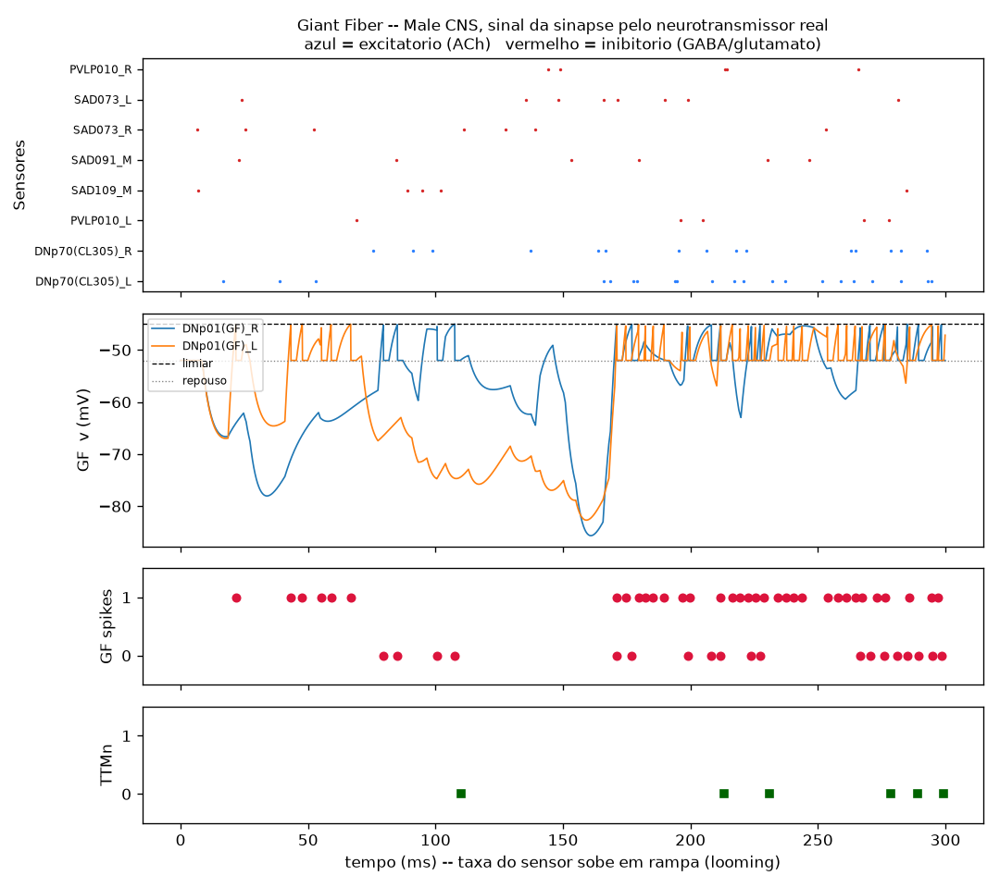

A inibicao (vermelho) empurra o potencial do GF ate −120 mV enquanto o looming
(azul) ainda e fraco. Conforme a rampa sobe, a excitacao vence, o potencial cruza
o limiar em ~100 ms e a fuga sai em 140 ms. Repare que so o TTMn direito dispara
quase sempre: no dado, DNp01_R → TTMn_R tem peso 70 contra 20 do lado esquerdo.

### Achar o sensor certo

O "sensor visual" costumava ser os 8 upstream de maior peso — e esse conjunto
**nao continha nenhum LC4 nem LPLC2**, justamente os tipos que a literatura
descreve como a via de aproximacao que dispara a fuga. Ordenar por peso por
celula escondia a via certa: cada LC4 tem peso pequeno e sao centenas delas,
enquanto DNp70 sao 2 celulas de 799 e 617 sinapses.

Quem apontou o caminho certo foi a anotacao do proprio dataset. Entre os upstream
de superclass `visual_projection`, so dois tipos tem peso relevante:

```
LC4     6362 sinapses
LPLC2   4862
LoVP85    20     <- o terceiro colocado ja e ruido
```

### O que a inibicao faz aqui

Dos 1271 upstream, 501 sao inibitorios e carregam 36% do peso. Desligando **so**
as sinapses inibitorias e deixando todo o resto igual:

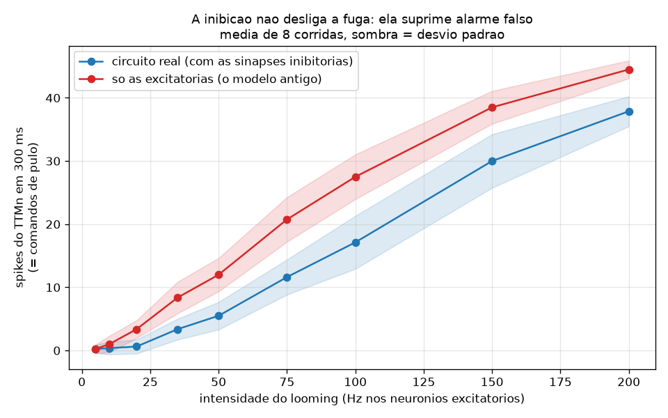

| looming (Hz/celula) | com inibicao | sem inibicao |
|---|---|---|
| 2 | 0,0 | 2,0 |
| 3 | 0,0 | 7,1 |
| 5 | 0,1 | 16,2 |
| 10 | 11,4 | 31,5 |
| 20 | 38,4 | 46,9 |

Ate 5 Hz a inibicao zera a fuga enquanto o circuito sem ela ja pula; em estimulo
forte as curvas convergem. A inibicao nao desliga o reflexo, ela levanta o limiar
de evidencia — o papel de portao que a literatura do Giant Fiber descreve. Saiu
do dado depois de corrigir o sinal, nao de ajuste de parametro.

### Um resultado negativo que vale registrar

A primeira tentativa de modelar os 1271 upstream deu **Poisson de fundo em todos
eles**. O GF passou a disparar 23 vezes em repouso, sem nenhum estimulo.

O motivo: com `W_sinapse` = 0,275 mV e limiar 7 mV acima do repouso, qualquer
conexao de 25 sinapses ou mais e supralimiar com **um** spike. No modelo de cerebro
inteiro isso e absorvido pela inibicao recorrente da rede toda; num recorte de duas
camadas, nao. Shiu et al. tratam disso com baseline de 0 Hz — nada dispara
espontaneamente, so o sensorio e estimulado. Adotamos o mesmo protocolo, e por
isso os 459 neuronios que nao sao nem looming nem inibitorios ficam em 0 Hz.

A taxa tonica de 5 Hz nos inibitorios continua sendo **suposicao nossa**: o
conectoma diz quem inibe e com que forca, nao a que taxa esses neuronios disparam.
Eles ficam ativos porque no cerebro inteiro quem os dispara e o resto da rede, que
nao simulamos.

Robo digital reagindo ao disparo real (pulo pra tras a cada spike do TTMn):

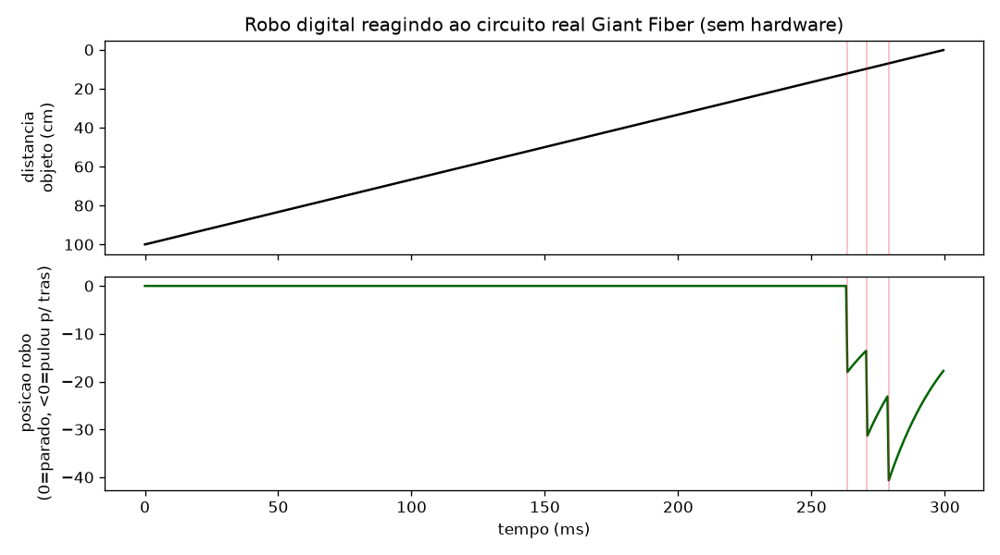

Ressalva honesta: o GF real dispara 1 ou 2 spikes por episodio de fuga, e o nosso
dispara dezenas. O refratario de 2,2 ms de Shiu et al. e generico pra todo neuronio
do cerebro e nao captura o comportamento de tiro unico do GF. Modelar a entrada
inteira melhorou o limiar (silencio real em repouso e abaixo de 5 Hz), mas nao
resolveu a taxa de disparo acima do limiar.


## Circuito 2 — Optomotor (vira em resposta a movimento visual)

Pathway: **T4/T5** (deteccao de movimento) → **HS** (wide-field integration) →
**DNa02** (descending neuron documentado como controlador de giro durante
caminhada) → **Sternal anterior rotator MN** (motoneuronio que gira a coxa).

Importante: verificamos conectividade real antes de montar a rede — **VS e
LPLC2/LC4 nao conectam direto no DNa02** nesse dataset (peso zero), so HS conecta
(fraco, mas real). O circuito usado e o que **existe de fato** nos dados, nao o
mais "obvio" da literatura de outras especies de mosca.

### Os dois hemisferios

O conectoma mostra que as tres etapas sao **estritamente ipsilaterais**:

```
HS  -> DNa02   L->L  66     R->R  72     cruzando: 0
DNa02 -> motor L->L 334     R->R 442     cruzando: 0
```

Zero peso atravessando a linha media. Sao dois canais paralelos, e e isso que
permite ler a direcao do giro do circuito: basta ver de que lado o motoneuronio
de perna disparou. Nada no codigo separa os lados — a rede e montada par a par a
partir do conectoma e os dois canais aparecem sozinhos.

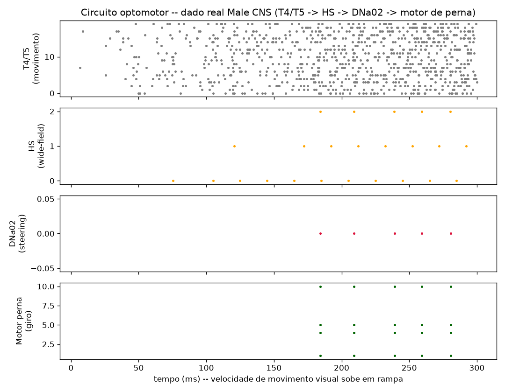

Estimulando um olho de cada vez, o motoneuronio contralateral fica em **zero
absoluto** nos dois casos. O robo digital entao vira pra lados opostos:

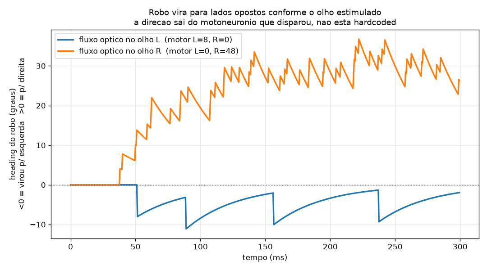

Duas ressalvas:

- **A amostra de T4/T5 tinha que mudar.** Antes era "top-20 por peso", e isso caiu
  17 do lado direito contra 3 do esquerdo — com a amostra tao torta nao havia como
  comparar os lados. Agora e top-10 por hemisferio.
- **O dado e assimetrico.** O lado direito e mais forte em toda etapa (T4/T5 721
  contra 637, DNa02→motor 442 contra 334), provavelmente reconstrucao mais completa
  desse hemisferio, e o limiar transforma ~10% de diferenca de peso em varias vezes
  de resposta (48 spikes contra 8). O LADO esta certo; a MAGNITUDE carrega o vies
  do dataset.

Continua fora do dado: que motor de um lado gira o robo PARA aquele lado. O
circuito entrega o lado, a biomecanica da coxa nao esta no conectoma.


## Simulador ao vivo (pygame) — os dois circuitos rodando ao mesmo tempo

`sim/live_robot_sim.py`: em vez de rodar 300ms e parar, os dois circuitos (Giant
Fiber + Optomotor) ficam ativos continuamente e voce controla o estimulo pelo
teclado enquanto ve o robo reagir em tempo real. Mesma prioridade do firmware
real: escape sempre interrompe um giro em andamento.

```
.venv\Scripts\python sim\live_robot_sim.py
```

A seta cima aproxima o objeto (looming). As setas esquerda/direita escolhem **em
qual olho** entra o fluxo optico — nao a direcao do giro. Quem decide o lado e o
motoneuronio de perna que disparou, e o HUD mostra a contagem dos dois lados
justamente pra isso ficar auditavel na tela.

Antes o pool optomotor era unico e o desenho girava pro lado da tecla: o dado
dizia **se e quando** girar, a direcao era fiat do codigo. Agora sai do circuito.

Fluxo optico entrando no olho direito. Repare no HUD: `L: 0   R: 51` — o
motoneuronio esquerdo fica em zero absoluto enquanto o direito dispara.

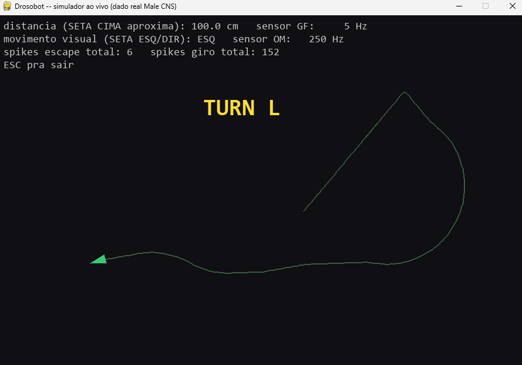

Depois, fluxo no olho esquerdo. A trilha guarda o giro anterior pra direita, e o
robo agora curva pro outro lado:

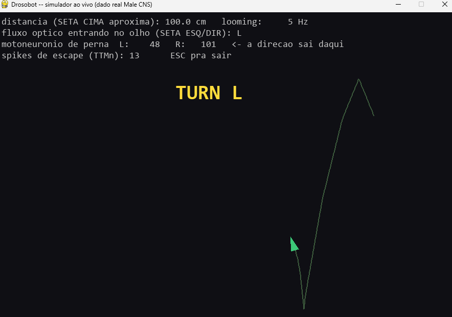

Escape disparando ao vivo (objeto a 5,4 cm, robo em vermelho durante a janela de
lockout que bloqueia giro):

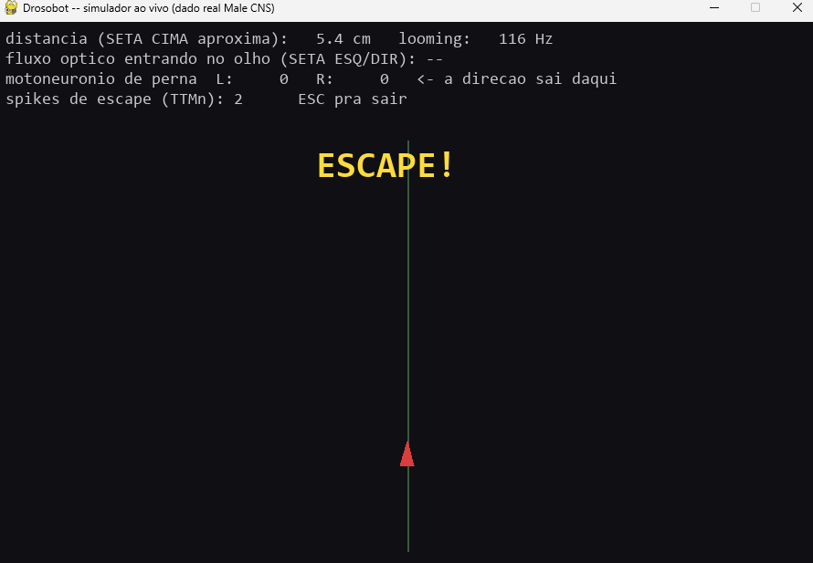

### A esquerda e mais dificil, e isso e o dataset

Usando o simulador fica obvio na mao: virar pra esquerda exige mais estimulo que
virar pra direita. Nao e bug do codigo — e o vies de reconstrucao do Male CNS
aparecendo no comportamento. O lado direito e mais forte em toda etapa do
circuito (T4/T5 721 contra 637, DNa02→motor 442 contra 334), e como o
motoneuronio tem limiar, ~10% de diferenca de peso vira varias vezes de diferenca
na resposta (48 spikes contra 8 na medida offline).

O LADO que o circuito escolhe esta certo e sem vazamento. A FACILIDADE de cada
lado carrega o vies do dataset. Vale lembrar disso antes de tratar qualquer
assimetria de comportamento como se fosse biologia.

Ajuste de ganho documentado (nao escondido): a primeira versao usava 6°/spike +
limite de 1 giro a cada 60ms — o robo fechava um loop completo em menos de 1
segundo e depois quase nao girava quando os dois freios foram empilhados (o
cooldown multiplicou o efeito do grau baixo). Solucao: manter so 1 parametro
(2°/spike) e deixar a taxa de disparo real do circuito decidir o ritmo, sem freio
artificial por cima.


## Laco fechado em 3D — NeuroMechFly v2 (MuJoCo)

O robo 2D de teste serviu pra provar que spike vira movimento. O passo seguinte e
por o circuito dentro de um corpo com fisica e olho de verdade. `sim/flygym_optomotor.py`
usa o **NeuroMechFly v2** (pacote `flygym`), modelo biomecanico da mosca em MuJoCo:

```
retina do flygym (2 olhos x 721 omatideos)
  -> energia de movimento por olho
  -> T4/T5 -> HS -> DNa02 -> motoneuronio de perna    (peso e sinal do conectoma)
  -> acao de shape (2,) do HybridTurningController
  -> a mosca anda e vira -> o mundo muda na retina -> fecha o laco
```

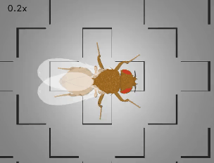

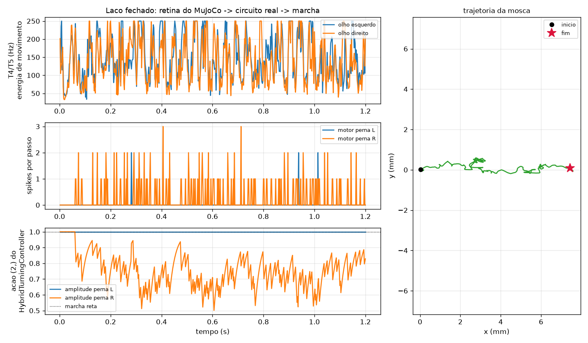

Video em resolucao cheia: [`docs/images/flygym_optomotor.mp4`](docs/images/flygym_optomotor.mp4)

O encaixe e direto de um jeito que vale apontar: o `HybridTurningController` recebe
o que a documentacao dele chama de *"descending signal encoding turning"*, de dois
elementos. DNa02 **e** um neuronio descendente de giro, e o circuito ja produz o par
esquerdo/direito porque as tres etapas nao cruzam a linha media no conectoma. A
interface da ferramenta e a anatomia coincidem sem adaptador no meio.

Note que a assimetria do dataset reaparece aqui: numa corrida de 1,2 s o
motoneuronio direito disparou 158 vezes contra 6 do esquerdo, entao so a perna
direita tem a amplitude modulada. Mesmo vies de reconstrucao ja documentado no
circuito optomotor, agora visivel na marcha.

### O que e dado e o que e nosso

| vem do conectoma | e suposicao nossa |
|---|---|
| quem conecta em quem, com que peso | retina → taxa de T4/T5 (energia de movimento = \|dI/dt\| por olho) |
| sinal de cada sinapse (neurotransmissor) | ganho dessa transducao (`FLOW_GAIN`) |
| de que lado esta cada neuronio | spike de motoneuronio → comando de marcha |
| que o circuito nao cruza a linha media | constante de tempo do comando descendente |

T4/T5 sao seletivos a direcao, mas nossa amostra e quase toda T5a — um subtipo so.
Por isso usamos **magnitude** de movimento em vez de fingir uma seletividade que a
amostra nao sustenta. A direcao do giro continua vindo de qual lado disparou.

### Percalcos

- **`vision_refresh_rate` nao e o passo de fisica.** Com refresh de 500 Hz e
  timestep de 1e-4 s, a retina so atualiza a cada 20 passos. Calcular a diferenca
  temporal a cada passo da exatamente zero em 19 de cada 20, a taxa de T4/T5 vai
  pra 0 Hz e o circuito nunca dispara. A flag e `info["vision_updated"]`.
- **O comando precisa ser filtrado.** Numa janela de 2 ms costuma cair 1 spike so,
  e o balanco cru entre os lados salta entre −1 e +1 a cada quadro. Comando
  descendente integra no tempo; sem media movel a acao vira ruido.
- **Terreno liso nao serve.** Sem contraste visual nao ha fluxo optico e o circuito
  nao tem o que detectar. Usamos `BlocksTerrain`.
- **Os exemplos de visao do flygym exigem `torch`** (eles usam uma CNN treinada).
  Nao precisamos: o circuito real faz esse papel. O `__init__.py` do pacote
  `flygym.examples.vision` importa torch, entao as arenas visuais de la so carregam
  via `importlib` apontando pro arquivo.


### Assistir ao vivo

Os dois scripts acima rodam headless e cospem video. Pra ver acontecendo, com o
viewer do MuJoCo e o estado do circuito no terminal:

```
.venv\Scripts\python sim\flygym_live.py            # Giant Fiber (objeto aproximando)
.venv\Scripts\python sim\flygym_live.py optomotor  # giro por fluxo optico
```

A camera segue a mosca sozinha, e a **esfera acima dela mostra o estado do
circuito** -- cinza quieto, amarelo LC4/LPLC2 disparando, vermelho fugindo (no modo
optomotor: azul virando pra esquerda, laranja pra direita). Isso importa porque a
29x mais devagar que tempo real o deslocamento por quadro e minusculo, e sem
indicador a cena parece travada mesmo estando rodando.

Arrastar gira a camera, scroll da zoom, espaco pausa. O terminal mostra o limiar
acontecendo:

```
t= 2.95s  objeto  12.1mm  LC4/LPLC2 L=  6.2 R=  4.7 Hz  TTMn=51  andando
t= 3.01s  objeto  10.2mm  LC4/LPLC2 L=  0.0 R=  6.8 Hz  TTMn=51  andando
t= 3.04s  objeto   9.2mm  LC4/LPLC2 L= 12.0 R=  8.0 Hz  TTMn=53  FUGA
```

Dispara perto de 9 mm, quando a taxa cruza ~10 Hz -- que e onde a curva do portao
(`sim/inhibition_gate.py`) diz que a fuga comeca.

Roda cerca de 29x mais devagar que tempo real. Pra assistir isso ate ajuda.

### Onde o tempo vai (e onde NAO vai)

A pergunta obvia e se da pra jogar isso na GPU. Medimos:

| parte | custo por segundo de mosca |
|---|---|
| fisica do MuJoCo + controlador de marcha | ~22 s |
| renderizar as duas retinas a 100 Hz | ~4 s |
| rede spiking (integrador proprio) | ~0,1 s |
| *(rede spiking no Brian2, como era antes)* | *~7,7 s* |

**A GPU ja esta sendo usada no que ela pode fazer.** Confirmado em tempo de
execucao: `GL_RENDERER: AMD Radeon RX 6700 XT`, OpenGL 4.6 -- a renderizacao da
retina roda na placa. O que domina o custo e a **fisica**, e o MuJoCo classico
resolve dinamica em CPU por design; nao existe caminho de GPU pra isso aqui.
(Existe o MJX, que roda em JAX/GPU, mas ele serve pra simular milhares de
ambientes em paralelo, nao pra deixar um unico mais rapido, e depende de CUDA.)

Duas coisas valem pra quem for mexer:

- **`net.run()` do Brian2 tem overhead FIXO por chamada**, independente da duracao
  simulada: medimos `run(2ms)` e `run(20ms)` custando o mesmo. Por isso a janela
  ao vivo usa `sim/fast_lif.py`, que resolve as mesmas equacoes em forma fechada e
  sai 70x mais barato. O Brian2 continua sendo a referencia de todos os scripts de
  figura, e `python sim/fast_lif.py` compara os dois.
- **Renderizar a retina domina o resto.** A 500 Hz custava ~18 s por segundo de
  mosca; a 100 Hz cai pra ~4 s e ainda sobram 80 amostras por ciclo.

Aumentar o passo de fisica daria 2x, mas **nao e ganho de graca**: medimos a mosca
andando 11 mm/s com passo de 1e-4, 14 mm/s com 2e-4 e 45 mm/s com 1e-3. A
simulacao nao esta convergida nesse passo, entao afrouxar troca velocidade por
fidelidade -- ruim num projeto cuja tese e que o comportamento vem do circuito.

Cuidado ao mexer nisso: a adaptacao do fundo do detector de looming e 0,3 s de
tempo real, mas no codigo vira numero de atualizacoes de retina. Mudar a taxa da
retina sem recalcular deixa a adaptacao 5x mais lenta sem avisar.

### Giant Fiber no mesmo laco: objeto aproxima, a mosca recua

`sim/flygym_escape.py` leva o circuito de fuga pro corpo biomecanico. Uma esfera se
aproxima de frente em ciclos: vem de 30 mm ate 4 mm, some, reaparece longe, repete.

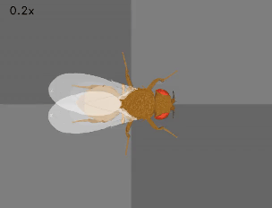

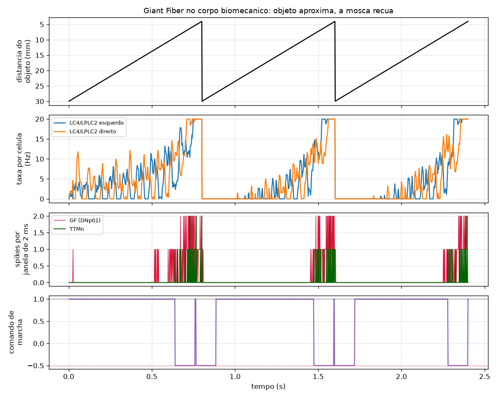

Video em resolucao cheia: [`docs/images/flygym_escape.mp4`](docs/images/flygym_escape.mp4)

A taxa de LC4/LPLC2 sobe acompanhando a aproximacao e zera quando o objeto reinicia
longe. GF e TTMn disparam em rajada so perto do fim de cada ciclo, e o comando de
marcha recua em janelas curtas sincronizadas com isso. Objeto longe nao dispara
nada — o limiar e real.

LC4 e LPLC2 vem separados por hemisferio no dataset (L 165 celulas, R 146), entao
o olho esquerdo alimenta o LC4/LPLC2 esquerdo e vice-versa, igual ao optomotor.

Suposicao nossa que vale destacar: **o que "fugir" significa num modelo de
caminhada**. O NeuroMechFly nao pula, e o TTMn real move o musculo de pulo.
Mapeamos spike de TTMn em recuo rapido, que e o mais proximo disponivel.

#### Duas tentativas que falharam antes

Detectar looming a partir de uma retina simulada e menos obvio do que parece, e as
duas primeiras versoes falharam de jeitos diferentes:

1. **Diferenca de intensidade media entre quadros.** Nao funcionou: o fluxo optico
   da propria caminhada sobre o chao xadrez domina o sinal e o objeto some no meio.
   A taxa ficava colada no teto o tempo todo, sem nenhuma correlacao com a distancia.
2. **Fracao de omatideos escuros, derivada entre quadros consecutivos.** A fracao
   escura e robusta ao fluxo do chao (andar sobre chao plano nao muda quanto do
   campo visual esta escuro), mas a mosca balanca o corpo ao andar, entao a fracao
   treme quadro a quadro — e derivada de sinal tremido e ruido.

O que funcionou foi comparar a fracao escura com uma **media lenta** dela mesma
(~0,3 s) em vez do quadro anterior. Robusto ao tremor, e e o que um detector de
looming real faz de qualquer jeito: adapta ao fundo e responde ao que destoa dele.


### O reflexo serve pra alguma coisa? (resultado negativo)

Ate aqui a mosca reagia a um estimulo que **nos** empurravamos na cara dela num
cronograma fixo. `sim/flygym_avoidance.py` testa a pergunta seguinte: ela anda
livre entre postes, o fluxo optico vem do movimento dela propria, e o circuito
deveria desviar. Como o conectoma da o lado mas nao diz para que lado virar,
rodamos as duas convencoes contra um controle cego.

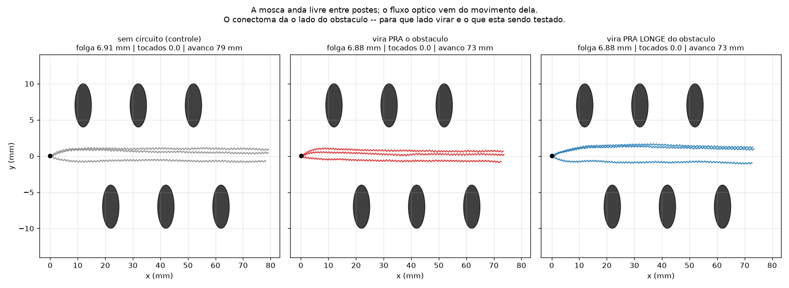

| | avanco | folga media | postes tocados |
|---|---|---|---|
| sem circuito (controle) | 79,0 mm | 6,91 mm | 0 |
| vira PRA o obstaculo | 73,3 mm | 6,88 mm | 0 |
| vira PRA LONGE dele | 73,1 mm | 6,88 mm | 0 |

**Nao funciona, e nao e ajuste de parametro.** Medindo o circuito isolado com as
taxas que um poste lateral realmente produz (~205 Hz no olho de perto, ~122 no
outro, medidos na propria simulacao):

| entrada (Hz) | motor L | motor R | L − R |
|---|---|---|---|
| 122 / 122 (sem poste) | 0,0 | 16,0 | −16,0 |
| 205 / 122 (poste a esquerda) | 5,8 | 16,0 | −10,2 |
| 122 / 205 (poste a direita) | 0,0 | 38,6 | −38,6 |

O sinal de (L − R) e **sempre negativo**, esteja o obstaculo de que lado for. O
canal esquerdo fica mudo com entrada simetrica e so acorda perto de 205 Hz. Um
controlador que leia "de que lado" pela comparacao bilateral nao tem como
funcionar: nessa faixa o circuito reporta QUANTO, nao DE QUE LADO.

A causa e a assimetria de reconstrucao do Male CNS, a mesma ja documentada no
circuito optomotor -- o hemisferio direito e mais forte em toda etapa (T4/T5 721
contra 637, DNa02→motor 442 contra 334). Com limiar nao-linear o lado esquerdo
fica abaixo do limiar e nao contribui. Com contraste extremo entre os olhos (200
contra 15 Hz) a lateralizacao e limpa; um poste passando nao chega perto disso.

Vale dizer o que isso **nao** significa. Nao e que a mosca real nao desvie de
obstaculo, nem que o circuito biologico nao saiba de que lado esta a coisa. E que
**este modelo, com este dataset, nesta faixa de entrada**, perde a informacao de
lado. O gargalo e o vies do dataset atravessando ate o comportamento -- o que ja
tinha aparecido como "virar pra esquerda e mais dificil" no simulador 2D, aqui
aparece como incapacidade de desviar.

As seis tentativas ate chegar nessa conclusao estao no cabecalho do script, pra
quem quiser atacar de novo sem repetir o caminho.

## Visualização 3D — a morfologia real dos neurônios usados

Os dois circuitos acima não são grafo abstrato: cada neurônio tem morfologia 3D
reconstruída por microscopia eletrônica. `blender/render_circuits.py` monta a cena
no Blender com a malha do cérebro+VNC do Male CNS (template `JRCFIB2022M`, via
`navis-flybrains`) e os esqueletos reais dos 54 neurônios das duas simulações,
coloridos por papel no circuito.

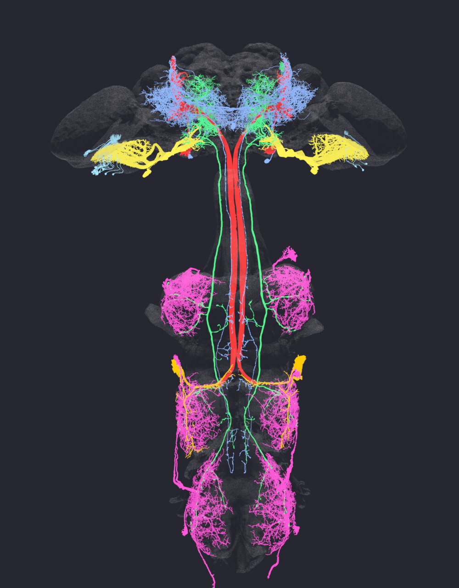

| cor | grupo | papel |
|---|---|---|
| vermelho | `gf_dnp01_giantfiber` | Giant Fiber (DNp01) |
| laranja | `gf_ttmn_motor` | motoneurônio de pulo (TTMn) |
| azul | `gf_sensor_visual` | entrada visual (PVLP) |
| azul claro | `om_sensor_t4t5` | detecção de movimento (T4/T5) |
| amarelo | `om_hs_widefield` | integração wide-field (HS) |
| verde | `om_dna02_steering` | comando de giro (DNa02) |
| magenta | `om_leg_motor` | motoneurônio de perna |

A vista frontal é a melhor checagem de sanidade do pipeline: os dois hemisférios
espelham limpo. Escala ou eixo errados quebrariam essa simetria na hora.

A espessura não é decorativa — usa o raio real de cada ponto do SWC. Por isso o
Giant Fiber aparece visivelmente mais grosso que o resto: ele é o axônio de maior
calibre do CNS da mosca (raio até 964 unidades contra mediana 32).

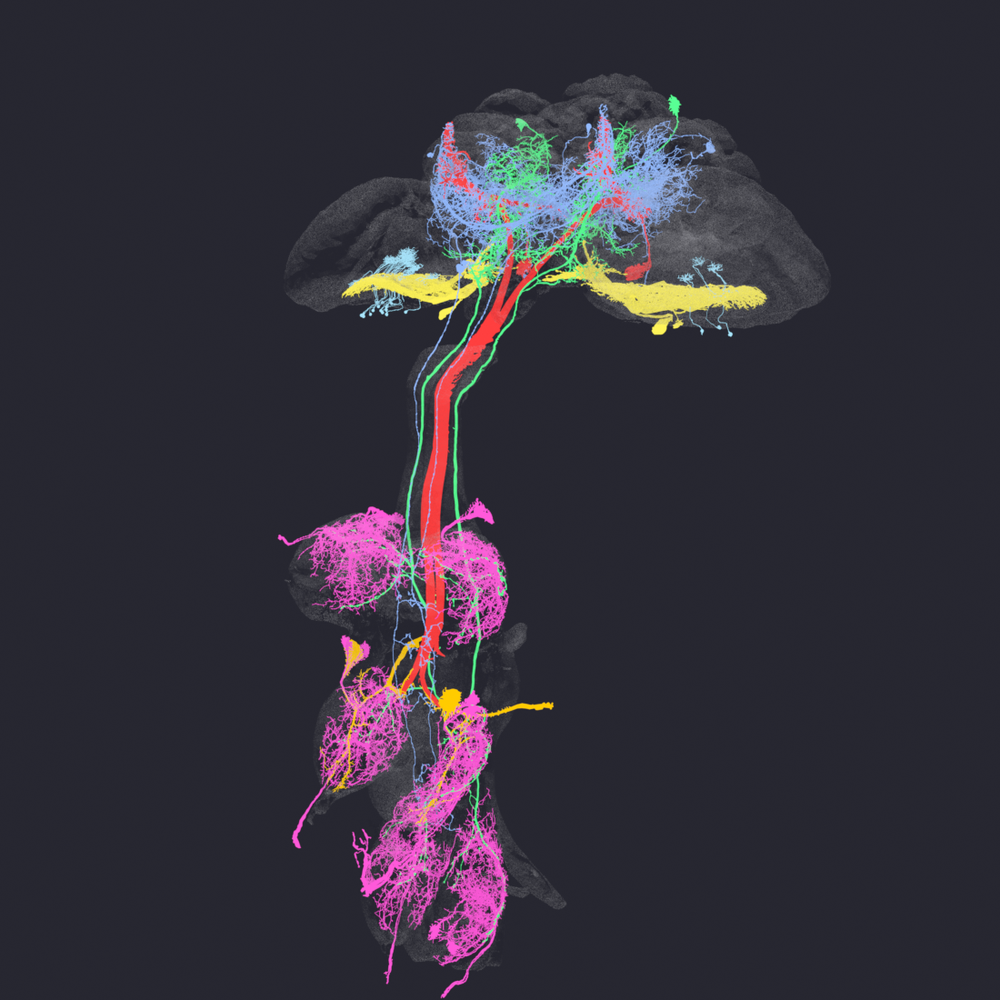

### Como rodar

```
.venv\Scripts\python connectome\fetch_skeletons_for_blender.py   # gera .swc + .obj (uma vez)
"C:\Program Files\Blender Foundation\Blender 5.2\blender.exe" --python blender\render_circuits.py
```

Pra regerar as imagens acima sem abrir janela: `blender.exe --background --python blender\render_doc.py`.

O Python embutido do Blender é isolado (ignora user-site e `PYTHONPATH`), então o
`navis` precisa ser instalado num diretório próprio que o script insere no
`sys.path`:

```
"C:\Program Files\Blender Foundation\Blender 5.2\5.2\python\bin\python.exe" -m pip install --target blender\_pylibs navis
```

`blender/_pylibs/`, os `.swc` e os `.obj` são gerados/vendorizados (~420 MB) e não
sobem pro git, igual os CSV do `connectome/`.

### Percalços reais, documentados pra não repetir

Os neurônios simplesmente **não apareciam** na cena — carregavam sem erro, 54
objetos com nome certo, nada visível. Quatro causas empilhadas:

1. **`navis.interfaces.blender.Handler` tem `scaling=1/10000` por padrão.** Ele
   aplica isso *em cima* de qualquer escala já aplicada no neurônio. O esqueleto
   ficava 10.000x menor que a malha — um ponto preto perto da origem. Toda a
   conversão (voxel → nm → viewport) deve ir no construtor do `Handler`, e só lá.
2. **Unidade.** O esqueleto do neuPrint vem em voxel (`n.units == "8 nanometer"`),
   a malha do `flybrains` já vem em nanômetro puro. Sem o fator 8 o neurônio sai
   8x menor.
3. **`bpy.ops.wm.obj_import` converte eixo por padrão** (OBJ Y-up → Blender Z-up,
   troca Y↔Z e nega um deles). Os esqueletos entram pelo navis sem essa conversão,
   então malha e neurônio ficavam em orientações diferentes. Corrigido com
   `forward_axis='Y', up_axis='Z'`.
4. **Bevel chapado escondia a estrutura.** `bevel_depth` fixo era ~8x a mediana do
   raio real, e os arbores finos inchavam até se fundirem num bloco sólido.
   `use_radii=True` usa o raio real por ponto.

Lição de método: `obj.dimensions` levou a diagnóstico errado por um bom tempo. Com
um bevel grosso numa curva minúscula, ele reporta basicamente o bevel — mudar a
escala dos pontos quase não mexia no número. `blender/diagnose.py` calcula o bbox
percorrendo os pontos da curva com a matriz de mundo, que é o que de fato mede.

## Firmware — testado no Wokwi, sem placa física

Ponte "burra" de propósito (`hardware/motor_bridge`): só lê HC-SR04 e executa o
comando de motor que o PC mandar. Toda decisão (fugir ou virar) vem do PC, rodando
os circuitos reais acima. Drive diferencial, 2 motores (L298N, canal A e B).
Protocolo serial 115200 baud:

- placa → PC: `D:<cm>` (leitura periódica, a cada 50ms)
- PC → placa: `E` (escape, os dois motores em reverso, 150ms)
- PC → placa: `L` / `R` (vira esquerda/direita, pivot 80ms)
- **Prioridade**: escape sempre interrompe um giro em andamento (igual biologia)

Testado no simulador Wokwi (extensão VS Code) antes de qualquer compra:

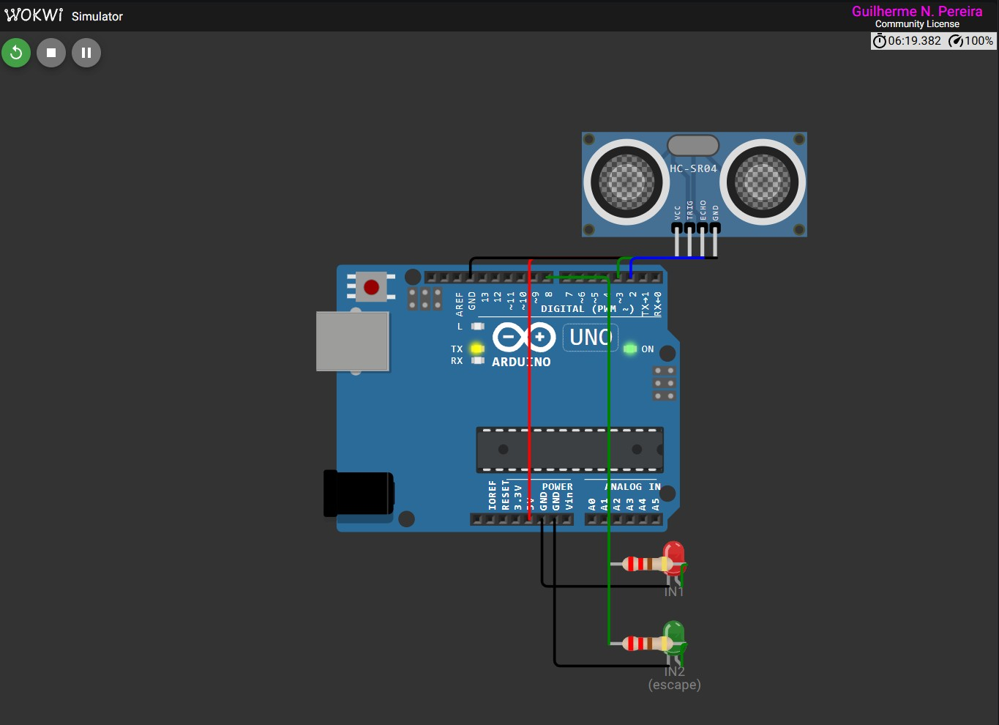

Percalços reais no caminho, documentados aqui pra não repetir:
- O chip `chip-l298n` (custom, GitHub) não carrega na extensão VS Code offline — só
  funciona no wokwi.com online. Solução: LED direto nos pinos IN1/IN2 pra validar a
  lógica do firmware sem depender do driver simulado. Não muda nada no firmware real.
- Extensão VS Code não tem painel "Serial Monitor" separado — é o próprio **Terminal**
  do VS Code, e desde a v2.1.0 tem [bug conhecido](https://github.com/wokwi/wokwi-features/issues/698)
  que não mostra o que você digita (mas o envio funciona normal, "às cegas").

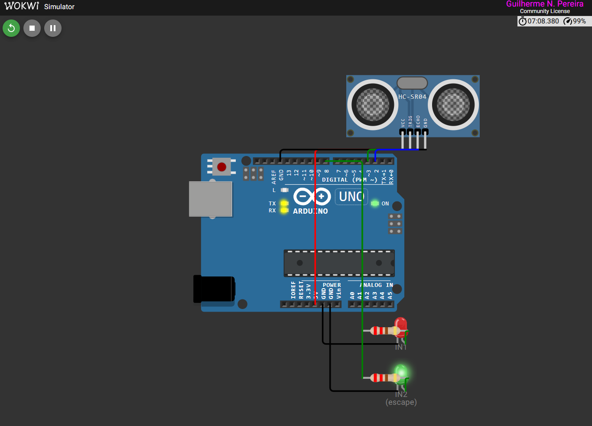

## Setup

```
py -3.11 -m venv .venv
.venv\Scripts\pip install -r requirements.txt
```

Testado: Python 3.11.9, Brian2 2.9.0, neuprint-python 0.6.3, numpy travado em `<2.1`
(Brian2 2.9.0 quebra com numpy 2.4 — `ndarray.ptp` foi removido).

## Acesso ao neuPrint (dado real do conectoma)

Server: `neuprint.janelia.org` — Dataset: `male-cns:v1.0`

Precisa de token pessoal (login necessário, não dá pra automatizar):
1. Login em https://neuprint.janelia.org (conta Google)
2. Account → copia o Auth Token
3. Salva em `.neuprint_token` na raiz do projeto (já no `.gitignore`, nunca vai pro git)

## Firmware — compilar e testar

```
arduino-cli compile --fqbn arduino:avr:uno hardware/motor_bridge --output-dir hardware/motor_bridge/build
```

No VS Code, com a extensão Wokwi instalada: abre `hardware/motor_bridge`, `F1` →
`Wokwi: Start Simulation`, digita `E` no painel Terminal pra disparar o escape.

`hardware/pc_bridge_test.py` (pyserial) fica pronto pra quando tiver placa física com
COM real — a extensão VS Code do Wokwi não expõe porta COM do host, só terminal interno.

## Estrutura

- `connectome/` — scripts de fetch no neuPrint + CSV de conectividade e de
  propriedades por neuronio (dado bruto, nao sobe pro git)
- `sim/` — simulacoes Brian2. `connectome_model.py` concentra a biofisica e a
  regra de sinal do neurotransmissor; os outros scripts montam circuito em cima dele.
  `flygym_optomotor.py` e `flygym_escape.py` fecham o laco no corpo
  biomecanico em MuJoCo, `flygym_live.py` mostra isso numa janela.
  `fast_lif.py` e o integrador do laco ao vivo, verificado contra o Brian2.
  `flygym_avoidance.py` testa se o circuito guia desvio (nao guia -- ver secao)
- `hardware/` — firmware Arduino/ESP32 + diagrama Wokwi
- `blender/` — cena 3D no Blender (malha do CNS + esqueletos reais); `_pylibs/`,
  `skeletons/` e os `.obj` sao gerados/vendorizados, nao sobem pro git
- `docs/images/` — imagens usadas neste README

## Roadmap / Status

- [x] Ambiente Python validado (Brian2 + neuprint-python)
- [x] Circuito 1 (Giant Fiber) — fetch, rede, robô digital reagindo
- [x] Firmware compilado e testado no Wokwi (sem hardware físico)
- [x] Circuito 2 (Optomotor) — fetch, rede, robô digital virando
- [x] Combinar os dois circuitos num robô só, ao vivo, controlado por teclado (`sim/live_robot_sim.py`), com HUD e prioridade escape > giro validados visualmente
- [x] Firmware com drive diferencial (2 motores, `E`/`L`/`R`, prioridade escape > giro)
- [x] Visualizacao 3D da morfologia real dos 54 neuronios sobre a malha do CNS
      (`blender/render_circuits.py`), validada pela simetria bilateral
- [x] Sinal da sinapse vindo do neurotransmissor real (nao mais tudo excitatorio)
      e biofisica publicada de Shiu et al. 2024 no lugar do LIF sem unidade
- [x] Dois hemisferios separados no optomotor: a direcao do giro sai do circuito
- [x] Entrada real do Giant Fiber: 1271 upstream, com LC4/LPLC2 como via de
      looming (o top-8 por peso nao continha nenhum dos dois)
- [ ] Taxa de disparo do GF acima do limiar: dispara dezenas de vezes onde o real
      dispara 1 ou 2. O refratario generico de 2,2 ms nao captura o tiro unico
- [x] Laco sensorio-motor fechado em 3D: retina do NeuroMechFly v2 -> circuito
      real -> marcha da mosca biomecanica em MuJoCo (`sim/flygym_optomotor.py`)
- [x] Giant Fiber no mesmo laco 3D: esfera aproximando dispara recuo
      (`sim/flygym_escape.py`)
- [x] Janela ao vivo do laco 3D (`sim/flygym_live.py`) e GIFs no README
- [x] Testar se o reflexo tem FUNCAO (desvio de obstaculo): resultado negativo,
      o vies do dataset apaga a informacao de lado nessa faixa de entrada
- [ ] Corrigir o vies de hemisferio (normalizar por lado?) e repetir o desvio
- [ ] Comprar kit físico (favorito atual: Kuyshun ESP32-CAM 328P — tem HC-SR04 +
      arquitetura dual-MCU ESP32-CAM/ATmega328P já pronta, resolve o aperto de GPIO)
- [ ] Portar firmware simulado pro hardware real, validar ponta a ponta

## Referencias

- Shiu, P. K. et al. (2024). *A Drosophila computational brain model reveals
  sensorimotor processing*. **Nature** 634:210. LIF do cerebro inteiro em Brian2 a
  partir do FlyWire + predicao de neurotransmissor. De onde vem toda a biofisica
  usada aqui (`sim/connectome_model.py`) e a regra de sinal por neurotransmissor.
- Jin, Z., Zhu, Y., Zhang, C., Sui, Y. *Whole-Brain Connectomic Graph Model Enables
  Whole-Body Locomotion Control in Fruit Fly* (FlyGM, arXiv). Usa o conectoma como
  grafo de message-passing treinado por RL pra controlar uma mosca biomecanica
  simulada. Classifica o sinal do neurotransmissor diferente de Shiu (ver tabela
  acima). Caminho alternativo ao nosso: eles treinam a dinamica, nos rodamos a
  conectividade direto.
- neuPrint / Male CNS v1.0, Janelia — https://male-cns.janelia.org/download/
