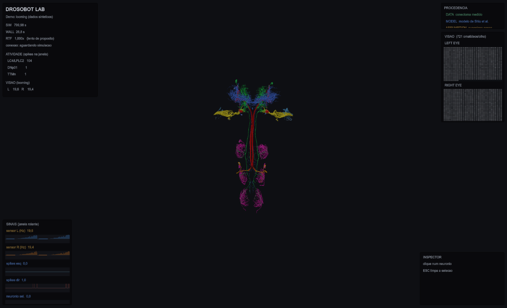
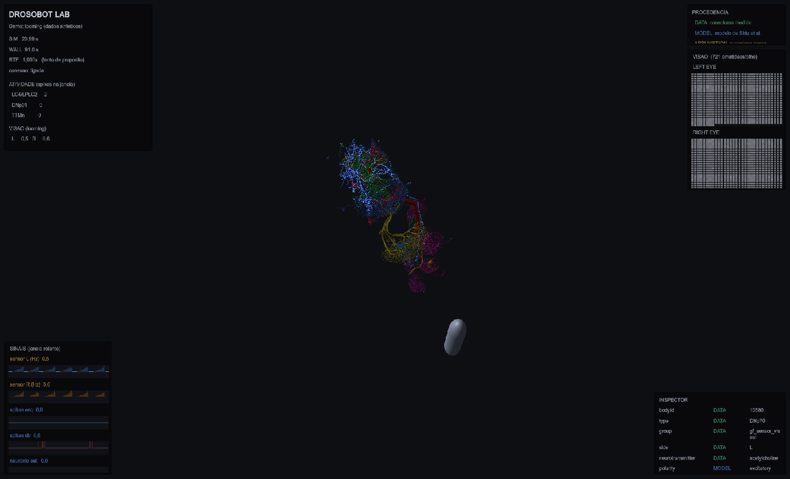

# Drosobot Lab

Laboratorio virtual pros circuitos reais do conectoma: a mosca biomecanica
rodando em MuJoCo, o CNS 3D reconstruido acendendo conforme a atividade, e a
separacao entre dado medido e suposicao nossa visivel na tela.

## Arquitetura

```
Male CNS / neuPrint  ──>  connectome/*.csv
                              │
                    sim/connectome_model.py      params Shiu et al., NT -> sinal
                              │
              ┌───────────────┴───────────────┐
          Brian2                        sim/fast_lif.py
      (figuras, referencia)          (laco ao vivo, verificado
                              │       contra o Brian2)
                              │
                      FlyGym / MuJoCo              <- AUTORIDADE DA FISICA
                              │
                   pose + sensores + atividade
                              │
                      sim/telemetry/              <- MAO UNICA
                              │
                     unity/DrosobotLab/           <- so visualizacao
```

**A Unity nao decide nada.** Ela nao simula fisica, nao simula neuronio, nao
escolhe se a mosca virou ou escapou. MuJoCo continua sendo a autoridade da fisica
e o circuito rodando sobre o conectoma a do comportamento. A telemetria e de mao
unica: nao existe caminho de volta.

Isso e o que evita o pior resultado possivel aqui, que seria ter duas
implementacoes do cerebro divergindo em silencio.

## Rodar

### 1. Exportar o CNS (uma vez)

```
"C:\Program Files\Blender Foundation\Blender 5.2\blender.exe" --background --python blender\export_unity.py
```

Sai em `unity/DrosobotLab/Assets/Resources/CNS/`: `cns.fbx` (52 MB) e
`neuron_metadata.json`. A Unity importa FBX **nativamente**, sem pacote algum.

O exportador **executa** o `render_circuits.py` em vez de refazer a cena, porque
aquele script carrega quatro correcoes de escala/eixo que custaram caro pra achar
(ver os comentarios la). Duplicar seria criar uma segunda copia pra sair de
sincronia.

### 2. Simulacao

```
.venv\Scripts\python sim\flygym_live.py --telemetry             # Giant Fiber
.venv\Scripts\python sim\flygym_live.py optomotor --telemetry   # Optomotor
.venv\Scripts\python sim\flygym_live.py --telemetry --record    # grava em runs/
```

Sem `--telemetry` nada muda: o objeto nulo tem metodos vazios e o custo e menor
que 5 us por chamada (com teste).

### 3. Sem MuJoCo, so pra desenvolver interface

```
python -m sim.telemetry.demo
```

Emite o mesmo protocolo em tempo real com numeros sinteticos. Existe porque 1 s
de mosca custa ~26 s de relogio, o que inviabiliza iterar em interface.

### 4. Replay

```python
from sim.telemetry import reproduzir
reproduzir("runs/2026-09-19_143002_live_escape")
```

Serve a corrida gravada na mesma porta. Pro visualizador nao ha diferenca entre
ao vivo e replay.

### 5. Unity



Paineis:

- **SINAIS** (canto inferior esquerdo): janela rolante de taxa sensorial por olho
  e spikes motores por hemisferio. Cada rotulo sai na cor da procedencia.
- **VISAO** (direita): os 721 omatideos de cada olho. A grade **nao e
  retinotopica** -- e leitura por omatideo na ordem em que o FlyGym entrega, nao
  mapa espacial do olho. Dito no codigo pra ninguem ler posicao onde nao ha.
- **INSPECTOR**: botao direito seleciona um neuronio, ESC limpa. Cada campo sai
  com sua etiqueta:



```
bodyId            DATA    10580
type              DATA    DNp70
group             DATA    gf_sensor_visual
side              DATA    L
neurotransmitter  DATA    acetylcholine
polarity          MODEL   excitatory
```

Selecionar atenua os outros neuronios pra 25% e pulsa o escolhido.

Verificado ao vivo: CNS real, cores por papel no circuito, atividade chegando
pela telemetria. Atalhos: **B** casca do cerebro, **N** neuronios, **P** modo
apresentacao; arrastar gira a camera, scroll da zoom.

A cena ja vem pronta em `Assets/Scenes/DrosobotLab.unity`. Abrir
`unity/DrosobotLab/` no Unity **2022.3 LTS** e dar Play.

Pra reconstruir a cena sem abrir o Editor (util depois de um clone limpo):

```
"C:\Program Files\Unity\Hub\Editor\2022.3.62f3\Editor\Unity.exe" ^
  -batchmode -nographics -quit ^
  -projectPath unity\DrosobotLab ^
  -executeMethod Drosobot.EditorTools.BuildLabScene.Build ^
  -logFile unity\build.log
```

O mesmo comando sem `-executeMethod` so compila -- e como o C# e verificado
neste projeto, ja que nao ha integracao MCP com o Editor.

## Protocolo

TCP, uma mensagem JSON por linha, porta 8765. Escolhido em vez de WebSocket
porque nao acrescenta dependencia e e trivial de ler com `StreamReader.ReadLine()`.

```json
{"protocol": "drosobot-telemetry", "version": 1, "type": "frame", ...}
```

| tipo | quando | conteudo |
|---|---|---|
| `hello` | ao conectar | identificacao |
| `experiment_info` | inicio (e reenviado a quem chega depois) | bodyIds por camada, parametros, **procedencia** |
| `scene_info` | inicio | arena, obstaculos, estimulo |
| `frame` | ~30 Hz | pose, drive, sim/wall/RTF |
| `neural_activity` | por janela de rede | spikes, v, g, refratario por camada |
| `retina` | mais espacado | 2x721 omatideos + derivados |
| `event` | discreto | escape_triggered, turn_left/right, ... |
| `statistics` | periodico | agregados |

Duas garantias, ambas com teste:

- **a simulacao nunca bloqueia.** `enviar()` so encosta numa fila limitada.
  Visualizador lento ou ausente faz descartar as mensagens mais antigas. Perder
  quadro e aceitavel; atrasar a fisica nao e.
- **desligada custa quase nada.**

`experiment_info` e `scene_info` sao guardados e reenviados a cada cliente novo.
Sem isso, conectar com a simulacao ja rodando dava tela vazia -- falha que so
apareceu no teste de integracao contra a simulacao de verdade.

## Procedencia: DATA / MODEL / ASSUMPTION

A separacao esta no protocolo, no metadata do CNS e na interface.

| | exemplo | o que e |
|---|---|---|
| **DATA** | bodyId, contagem de sinapse, neurotransmissor, hemisferio | medido no conectoma |
| **MODEL** | potencial de membrana, spike, polaridade excitatoria/inibitoria | modelo de Shiu et al. 2024 rodando sobre esse dado |
| **ASSUMPTION** | `FLOW_GAIN`, `LOOM_GAIN`, taxa tonica dos inibitorios, mapeamento spike -> marcha | escolha nossa, nao esta em lugar nenhum do dado |

## Cores

A cor vem do papel no circuito (`GROUP_COLORS` do Blender, preservado no
metadata). O **brilho** vem da atividade. Os dois sao separados de proposito:
atividade nao muda de que grupo o neuronio e.

```
intensidade = base + ganhoSpike * exp(-idade/tau) + ganhoTaxa * taxaRecente
```

Spike pisca, populacao ativa fica luminosa. Compressao logaritmica acima de um
teto pra um grupo de centenas de celulas nao virar mancha branca.

| cor | grupo | papel |
|---|---|---|
| vermelho | `gf_dnp01_giantfiber` | Giant Fiber (DNp01) |
| laranja | `gf_ttmn_motor` | motoneuronio de pulo |
| azul | `gf_sensor_visual` | entrada visual (PVLP) |
| azul claro | `om_sensor_t4t5` | deteccao de movimento |
| amarelo | `om_hs_widefield` | integracao wide-field (HS) |
| verde | `om_dna02_steering` | comando de giro (DNa02) |
| magenta | `om_leg_motor` | motoneuronio de perna |

## Desempenho

Medido nesta maquina (Ryzen 7 5700X, RX 6700 XT), por segundo de mosca:

| parte | custo |
|---|---|
| fisica do MuJoCo + controlador de marcha | ~22 s |
| retinas a 100 Hz | ~4 s |
| rede spiking (`fast_lif`) | ~0,1 s |

**A interface continua a 60 fps** mesmo com a simulacao a RTF ~0,03x. Lentidao
da simulacao nao e travamento da interface -- por isso o HUD mostra SIM, WALL e
RTF em destaque.

O passo de fisica **continua em 1e-4 s**. Aumentar daria 2x mas muda a fisica: a
mosca anda 11 mm/s com 1e-4, 14 com 2e-4 e 45 com 1e-3 (medido). Nao esta
convergido nesse passo, entao afrouxar troca fidelidade por framerate.

## Limitacoes conhecidas

1. **Controle do Editor: resolvido pelo Unity CLI.** O `unity` CLI
   (`~/AppData/Local/Unity/bin/unity`) com o pacote `com.unity.pipeline` expoe o
   Editor numa porta local, e dai saem `editor_play`, `console`,
   `capture_game_view`, `recompile`, `get_component_properties` e o resto. Com
   isso o laco foi verificado de ponta a ponta sem depender de ninguem operar a
   interface. **Exige Unity 6+** -- foi por isso que o projeto migrou de 2022.3
   LTS para 6000.3.2f1.
2. **`com.unity.pipeline` e experimental (0.7.0-exp.1)** e puxa
   `com.unity.nuget.mono-cecil`, que a Unity 6 sinaliza com assinatura invalida.
   E o preco do controle do Editor. Os outros 4 avisos de assinatura que existiam
   vinham do glTFast e sumiram quando trocamos GLB+Draco por FBX com import
   nativo -- o FBX nao precisa de pacote nenhum.
3. **A mosca na Unity e um marcador provisorio**, explicitamente nomeado como
   tal. Nao e o modelo do FlyGym. Trocar exige exportar a malha do NeuroMechFly.
   Um marcador identificado e melhor que anatomia inventada.
4. **Nem todo bodyId do experimento tem geometria.** O experimento de looming usa
   os 1271 pre-sinapticos do Giant Fiber, e o GLB so tem os 54 dos grupos
   originais -- entao LC4/LPLC2 nao acendem no cerebro. O `BrainActivity` avisa
   no console em vez de acender algo errado. Resolve regerando os esqueletos com
   `connectome/fetch_skeletons_for_blender.py`.
5. **7 dos 54 neuronios saem sem type/side/NT**: sao esqueletos T5a gerados antes
   de `fetch_optomotor_circuit.py` passar a amostrar por hemisferio.
   `blender/skeletons/` esta desatualizado em relacao aos CSVs.
6. **Ainda nao implementado**: seletor de experimento na interface, grafo de
   conectividade, painel de retina desenhado (hoje so os derivados), graficos de
   timeline, construtor de experimentos, inspector clicavel.

## Integridade cientifica

O resultado negativo de `flygym_avoidance.py` continua negativo. A interface deve
mostrar isso como resultado, nao esconder: *"este circuito reconstruido nao
sustenta desvio de obstaculo nestas condicoes"* e dado valido. Nenhum parametro
foi recalibrado pra fazer experimento parecer que funciona.
